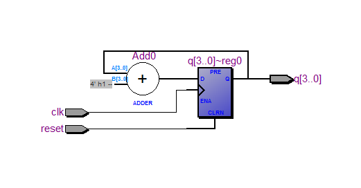
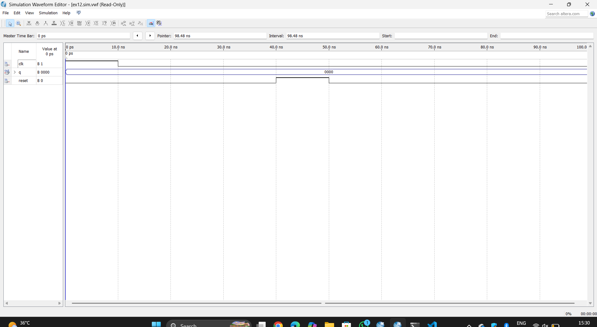

# 4-BIT-RIPPLE-COUNTER

**AIM:**

To implement  4 Bit Ripple Counter using verilog and validating their functionality using their functional tables

**SOFTWARE REQUIRED:**

Quartus prime

**THEORY**

**4 Bit Ripple Counter**

A binary ripple counter consists of a series connection of complementing flip-flops (T or JK type), with the output of each flip-flop connected to the Clock Pulse input of the next higher-order flip-flop. The flip-flop holding the least significant bit receives the incoming count pulses. The diagram of a 4-bit binary ripple counter is shown in Fig. below.


In timing diagram Q0 is changing as soon as the negative edge of clock pulse is encountered, Q1 is changing when negative edge of Q0 is encountered(because Q0 is like clock pulse for second flip flop) and so on.


**PROGRAM**
```module ex12(
    input clk,
    input reset,
    output reg [3:0] q
);

always @(posedge clk or posedge reset)
begin
    if (reset)
        q <= 4'b0000;
    else
        q <= q + 1;
end

endmodule
```

**RTL LOGIC FOR 4 Bit Ripple Counter**


**TIMING DIGRAMS FOR 4 Bit Ripple Counter**


**RESULTS**
Thus the program 4 Bit Ripple Counter is verified successfully.